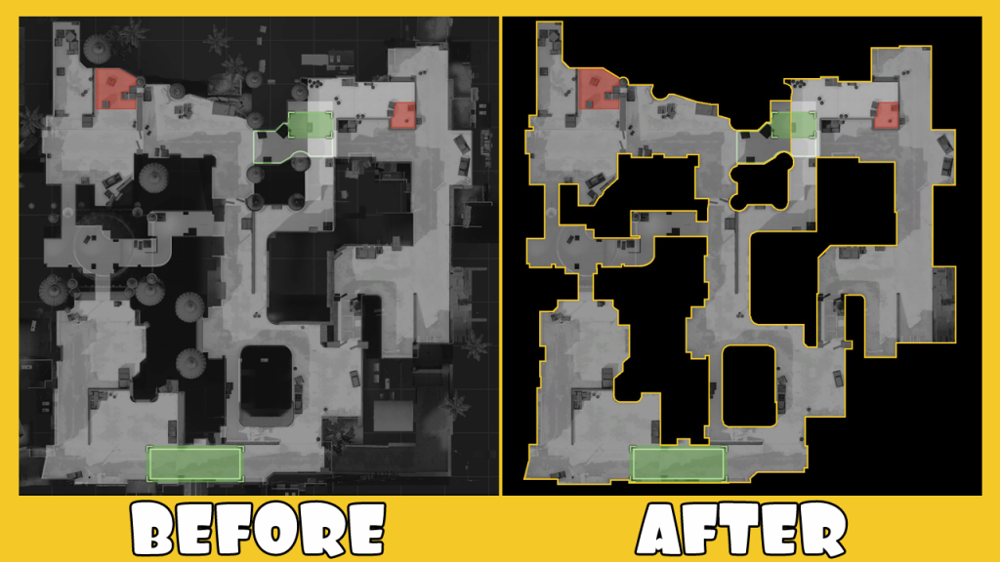

#Installing Banana Gaming Rader mod

1. Open folder "BananaGaming Version".
2. Put the files in csgo\resource\overviews and replace them with original ones.
3. If you don't want them, replace the files in "Original Version" to get default.

- Clean Radar, with strokes to see everything easier
- 100% Safe, no worries, Valve won't ban you for this

http://bananagaming.tv/custom-radarmini-map/

##Dust 2
 
##Mirage
 
##Inferno
 
